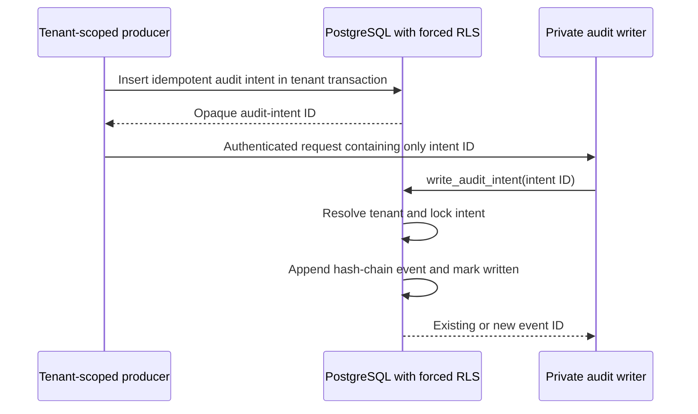

# Hosted audit writer

The private audit writer is Attune's only path from a durable audit intent to a
hash-chained hosted audit event. Callers cannot send a tenant or free-form event
to this privileged boundary; a caller-supplied tenant is never authoritative.

## Why the writer consumes intents

A central writer that accepted `{tenant_id, event}` over HTTP would turn any
compromised caller into a cross-tenant audit-forgery path. Google IAM would
authenticate the workload, but it would not prove the tenant in the request.
Attune therefore uses a transactional outbox:

1. the control plane, worker, or secret broker inserts an idempotent audit
   intent inside its transaction-local tenant context;
2. RLS and an insert trigger bind the intent to that tenant and the producer's
   database identity;
3. the dispatch broker uses a separate fixed-purpose function that derives the
   tenant and safe target digest from canonical dispatch state;
4. a caller invokes the private writer with only the opaque audit-intent UUID;
5. the writer's narrow database function resolves the intent, appends one
   event, and marks the intent written atomically.

## Authority and data contract

- `attune_control_plane`, `attune_worker`, and `attune_secret_broker` can insert
  and read tenant-visible intents; their trigger-enforced `producer_kind` cannot
  be substituted.
- `attune_dispatch_broker` has no direct audit table access. Its fixed function
  permits only a dispatch success or failure consistent with canonical intent
  state, hashes the dispatch target, and limits failure metadata to one bounded
  error code.
- `attune_audit_writer` has no direct table privileges and cannot execute the
  legacy free-form append function. It can execute only
  `write_audit_intent(uuid)`.
- PUBLIC has no table or function privilege. The database migrator verifies
  SECURITY DEFINER, fixed search paths, exact execute grants, and the absence of
  ambient table authority after every run.
- The HTTP body is exactly one canonical UUID and at most 1 KiB. It cannot
  carry tenant, actor, action, outcome, metadata, provider content, or secrets.

The event remains content-free by contract: identifiers or safe hashes,
decisions, versions, bounded result codes, and correlation metadata belong in
the audit; message bodies, tokens, model reasoning, and arbitrary exception
text do not.

## Failure and replay semantics

Intent creation is idempotent per tenant. Reusing a key for different event
content is refused. Writing an intent and updating the hash-chain head occur in
one database transaction. A crash rolls back both; a retry returns the existing
event ID. An unknown intent performs no write.

Security-sensitive callers must treat writer timeout, HTTP error, missing
intent, or database failure as an audit failure and refuse the protected effect.
They must not fall back to logs, a local file, a second database identity, or a
direct append call. Alerting and recovery of pending intents remain required
before customer traffic.

The dispatch broker applies this rule twice: a durable `allowed` event is
required before Cloud Task creation, and an `observed` event is required after
creation or deterministic `AlreadyExists`. Failure of the first creates no
task; failure of the second is retried from canonical dispatched state.

## GCP deployment evidence

`deploy/gcp/runtime` deploys the writer as an internal-ingress Cloud Run
service using the dedicated audit identity and private VPC access to Cloud SQL.
Only control-plane, worker, secret-broker, and dispatch-broker service accounts
receive `roles/run.invoker`. The service uses IAM database authentication, has
no static key, and is deployed by immutable image digest. Its state is separate
from both foundation and migration state.

Development verification covers cross-tenant visibility, producer
substitution, idempotency collision, direct-append denial, unknown intents,
replay, hash-chain mutation denial, strict HTTP parsing, generic failures,
Terraform drift, live internal ingress, exact invoker IAM, and absence of
user-managed service-account keys. This evidence does not by itself authorize
customer data or satisfy the hosted launch gates.
