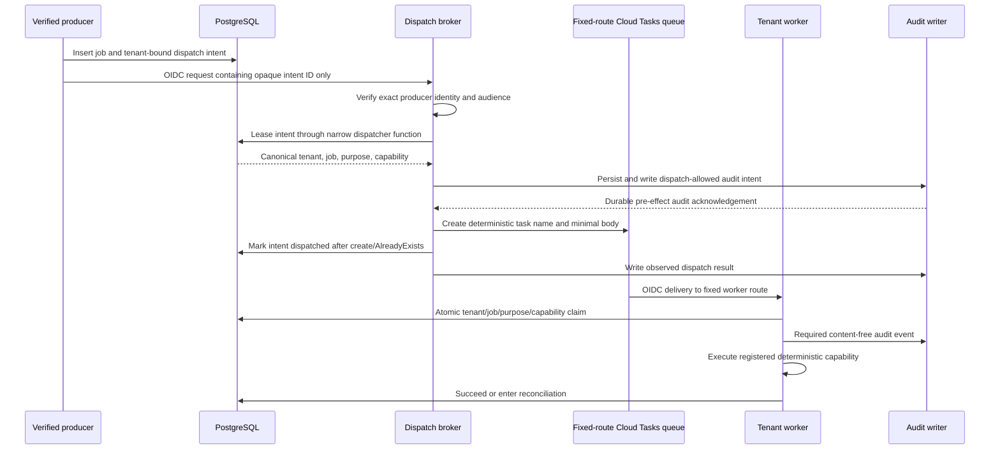

# Hosted dispatch broker

The dispatch broker is Attune's only Cloud Tasks producer. It converts a
tenant-bound, durable dispatch intent into one fixed-route task. It is an
authorization boundary, not a generic queue proxy, task-signing endpoint, or
model tool.

The normative requirements are in
[`security-architecture.md`](security-architecture.md). This document defines
the first GCP implementation contract.

## Why this boundary exists

Cloud Tasks OIDC authenticates the Google-managed caller at delivery time, but
does not make body fields supplied by an enqueuer an Attune authorization
statement. Giving ingress, control-plane, or worker identities both enqueue
permission and `actAs` permission on the delivery identity would let a
compromised producer choose arbitrary task targets and tenant identifiers.

The broker removes that ambient authority. Producers can request dispatch only
for canonical state they created within an already verified tenant transaction.
They cannot call Cloud Tasks or mint the worker's delivery identity directly.

The private HTTP adapter derives `control_plane`, `ingress`, or `worker` from a
Google-signed OIDC token whose issuer, exact custom audience, verified email,
subject, and lifetime are checked. All three identities must be distinct and
configured. The body is at most 1 KiB and exactly one canonical `intent_id`;
producer, tenant, queue, target, purpose, capability, task name, and delivery
identity fields are rejected at the request boundary.

## Trust flow

## Identities and permissions

| Identity | May invoke broker | May enqueue | May use delivery identity | Database access |
|---|---:|---:|---:|---|
| Ingress | Yes, ingress purposes only | No | No | Tenant-bound event/intents |
| Control plane | Yes, control purposes only | No | No | Tenant-bound jobs/intents |
| Worker | Yes, retry/follow-up purposes only | No | No | Tenant-bound jobs/intents |
| Dispatch broker | No | Exact queues only | Yes | Narrow intent lease/finalize functions |
| Task delivery | No | No | N/A | None |
| Tenant worker | No | No | No | Tenant-bound canonical jobs |

The broker and delivery identities are distinct. Cloud Tasks receives token-
creator permission on the delivery identity; the broker receives only
`serviceAccountUser` on that identity. No human or producer workload receives
either permission in steady state.

## Durable intent contract

A producer creates the job and dispatch intent in one tenant transaction. The
intent contains an opaque random ID, tenant and job IDs, producer class,
allowlisted purpose, expected capability, deterministic task name material,
expiry, and state. It contains no provider content, executable arguments,
credential, URL, or model output.

The broker request contains only the intent ID. OIDC establishes the producer
workload identity. A tightly scoped database function atomically checks that
the stored producer class matches that identity, the intent is unexpired and
dispatchable, and the referenced job has the stored purpose and capability.
It returns canonical routing data without granting the broker arbitrary table
or cross-tenant query access.

Before task creation, the broker must create and synchronously write the
fixed-purpose `task.dispatch`/`allowed` audit intent derived from the leased
dispatch record. Audit unavailability leaves the lease recoverable and creates
no task. After creation or deterministic `AlreadyExists`, the broker finalizes
the dispatch and writes the `observed` result. A replay of dispatched state
retries only that post-effect audit; it never creates a differently named task.

Intent states are `requested`, `leased`, `dispatched`, `failed`, and
`cancelled`. A bounded lease permits recovery after a broker crash. The Cloud
Task name is deterministic from the intent ID:

- create succeeds: finalize the intent as dispatched;
- create returns `AlreadyExists`: treat it as the same dispatch and finalize;
- create fails before acceptance: retain or release the lease for bounded
  retry;
- state is ambiguous: do not create a differently named task; reconcile using
  the same task name.

## Queue and worker contract

Each queue has an infrastructure-controlled routing override for one exact
service and path. User input and task bodies cannot select a URL. Route
configuration requires an HTTPS target and a path-free HTTPS OIDC audience;
credentials, query strings, fragments, and redirects are rejected. The
audience may be a distinct infrastructure-owned Cloud Run custom audience and
is still checked exactly by the worker. The broker
maps producer class and purpose to a fixed queue; unsupported combinations are
denied and audited.

The task body remains the small versioned tenant/job/delivery/purpose envelope.
The worker verifies the exact Cloud Tasks OIDC audience and delivery identity,
then atomically claims only a job whose tenant, kind, and capability match the
registered route. Duplicate delivery has no effect. Provider content and
executable arguments are fetched from canonical storage only after the claim.

Audit failure prevents execution. Provider or executor ambiguity moves the job
to reconciliation rather than allowing a blind retry. Write capabilities also
require their own provider idempotency and reconciliation design.

## Failure and revocation

- Removing broker invoker IAM disables a producer class.
- Removing queue enqueuer IAM or disabling the broker identity stops all new
  dispatch without changing workers.
- Disabling the delivery identity stops all task delivery.
- Queue pause provides an operational stop without discarding durable intents.
- Tenant, capability, connector, and global write-disable policy is checked
  again by the worker; a queued task never preserves stale authority.
- Refusals, leases, creation outcomes, duplicates, reconciliation, and
  emergency actions generate content-free audit records.

## Alternatives considered

**Direct producer enqueue** is simpler but grants target selection and delivery
identity use to too many workloads. It is rejected for hosted Attune.

**KMS-signed envelopes** can detect modification but do not constrain a
compromised producer that is itself allowed to sign. They add value only as a
supplementary cell or external transport control, not as the primary
authorization boundary.

**One queue per tenant** provides stronger infrastructure isolation but creates
substantial quota, lifecycle, and operational overhead. It remains an option
for higher-assurance tenant cells rather than the default shared control plane.

**Opaque one-time bearer capabilities** can bind a task to a job, but place a
secret in queue storage and operational tooling. The durable intent plus
exclusive broker authority provides revocable server-side state without making
the queue body a credential.

## Deployment gate

The function-only repository, fail-closed broker core, canonical Cloud Tasks
adapter, intent-only audit adapter, strict private HTTP boundary, production
composition root, and non-root container are implemented. The development
runtime deploys the broker only with the registered `platform.smoke` route by
default,
after the jobs queue is configured to override every task to the deterministic
worker's exact HTTPS method, path, delivery identity, and OIDC audience.
The fixed `google.gmail.profile.read` route exists behind one activation
variable that updates both dispatch and worker registries; Terraform rejects
activation without the dispatch broker and a paging notification channel.
Once active, the signed-in control plane can create only that fixed test. It
derives the principal's exact-scope active connector server-side, persists a
canonical job and dispatch intent, and sends only the intent UUID to the
private broker. Browser status polling is rebound to the same principal and
connector and returns only queued, running, succeeded, or failed.

The broker must not receive customer traffic until all of the following pass:

1. producers have lost direct queue and delivery-identity permissions;
2. queue routing is fixed to exact deployed worker targets;
3. intent lease/finalize functions pass cross-tenant, producer-substitution,
   expiry, crash, replay, and `AlreadyExists` tests;
4. the private audit writer is available and failure-tested (the intent-only
   path has live broker-to-worker end-to-end evidence in development);
5. worker routes are registered deterministic capabilities; and
6. Terraform, IAM, task creation, logs, and support output contain no customer
   content or secret material.

The content-free `platform.smoke` route now passes this infrastructure gate in
development. The Gmail profile route must remain dormant in a new environment
until test identity, verified paging, authenticated effect, revocation, and
reconciliation evidence are complete. Activation in one environment is not
evidence for another.
